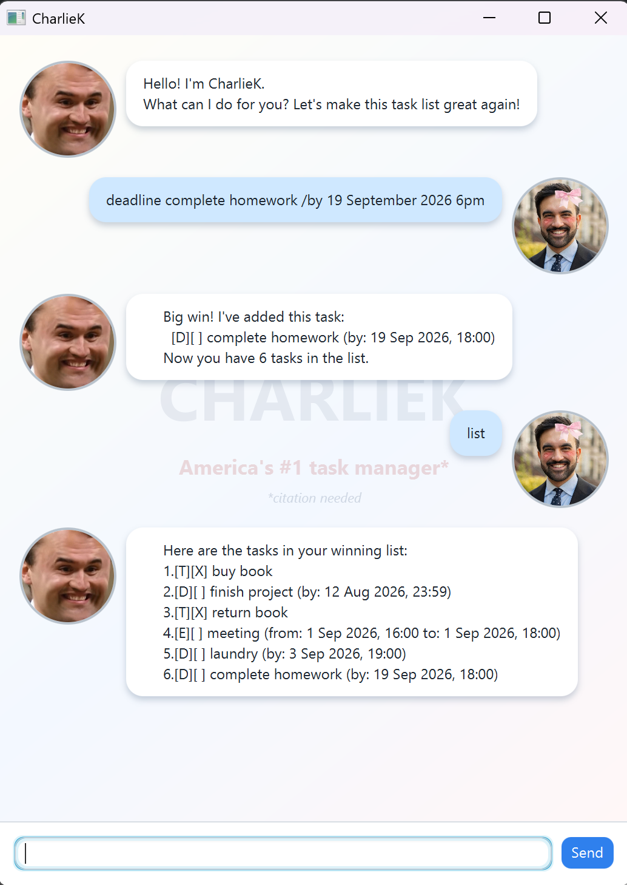

# CharlieK

CharlieK is a friendly Java 25 task manager with a JavaFX chat-style interface. Add to-dos, deadlines, and events, then find, sort, complete, or delete them with short commands.



## Highlights

- Add to-dos, deadlines, and events.
- Accept common date and time formats such as `2/12/2019`, `2019-12-2`, `1800`, and `6pm`.
- View tasks in insertion order or chronologically with `list time`.
- Search task descriptions with case-insensitive `find`.
- Save changes automatically to a local CSV file.
- Continue safely after invalid commands, malformed dates, duplicate tasks, and damaged saved rows.

## Quick start

Install JDK 25 or later, then run the following from the project folder.

macOS or Linux:

```text
./gradlew run
```

Windows PowerShell:

```text
.\gradlew.bat run
```

Type a command in the input box and press **Enter** or **Send**. Use `help` if you need a reminder. On the first run, CharlieK creates `data/charliek.csv` with sample tasks.

## Commands

| Action | Format | Example |
| --- | --- | --- |
| Add a to-do | `todo <description>` | `todo buy milk` |
| Add a deadline | `deadline <description> /by <date/time>` | `deadline submit report /by 2/12/2019` |
| Add an event | `event <description> /from <date/time> /to <date/time>` | `event meeting /from 2026-08-06 2pm /to 2026-08-06 4pm` |
| List tasks | `list` | `list` |
| Sort by time | `list time` | `list time` |
| Find tasks | `find <keyword>` | `find report` |
| Mark complete | `mark <number>` | `mark 1` |
| Mark incomplete | `unmark <number>` | `unmark 1` |
| Delete a task | `delete <number>` | `delete 1` |
| Show help | `help [command]` | `help deadline` |
| Exit | `bye` | `bye` |

Task numbers start at `1` and refer to the order shown by `list`. Search results are for viewing; run `list` before editing or deleting a task found by `find`.

## Saving and errors

Tasks are saved automatically after successful additions, status changes, and deletions. The file is stored at `data/charliek.csv`, relative to the folder from which the application is started.

- Missing data files are created with the starter tasks.
- Existing files, including empty files, are loaded as-is.
- Malformed CSV rows are skipped when possible so valid tasks remain available.
- Unreadable or unwritable data paths produce a helpful message instead of silently losing the session.

For the complete command guide, date/time reference, and troubleshooting notes, see the [user guide](docs/README.md).

## Build and test

Run the full verification suite, including compilation, Checkstyle, and JUnit tests:

```text
./gradlew check
```

On Windows PowerShell:

```text
.\gradlew.bat check
```

The end-to-end console cases are documented in the [UI test plan](test/ui-test-plan.md).
